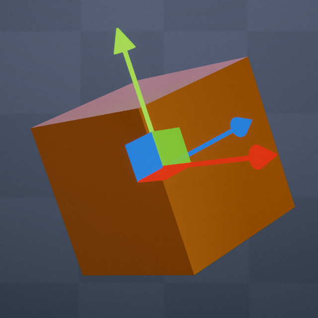

# Runtime Transform Handles for Unity 



## About

This project is based on https://github.com/pshtif/RuntimeTransformHandle. 

Unity Runtime Transform Handles is a powerful tool that allows developers to transform objects at runtime using a set of intuitive and professional gizmos. Ideal for building modding tools, runtime editors, or games that require object manipulation, this plugin adds multiple object selection, changeable origin points, better auto scale, multiple handles, and other features to the base project. Easy to use and extend, Unity Runtime Transform Handles is an invaluable tool for any developer looking to add object manipulation capabilities to their project.

### Video
[](https://www.youtube.com/watch?v=-6tpim397F0)

## Install

1. Open the Package Manager from `Window > Package Manager`
2. `"+" button > Add package from git URL`
3. Enter the following
   * https://github.com/manaporkun/UnityRuntimeTransformHandles.git?path=/Packages/runtime-transform-handles

Or, open `Packages/manifest.json` and add the following to the dependencies block.

```json
{
    "dependencies": {
         "com.orkunmanap.runtime-transform-handles": "https://github.com/manaporkun/UnityRuntimeTransformHandles.git?path=/Packages/runtime-transform-handles/"
    }
}
```

## Main Components

### ObjSelector.cs

It allows the user to select and manipulate objects in the scene using a TransformHandle system. And it shows basic usage of the handles.

### TransformHandleManager.cs

TransformHandleManager handles the creation and manipulation of the transform handles. The Handle and Ghost classes are used to represent the visual components of the handles and the targets they manipulate.

The CreateHandle and CreateHandleFromList methods are used to create new transform handles, and the DestroyHandle and DestroyAllHandles methods are used to destroy them. Targets can be added and removed from handles using the AddTarget and RemoveTarget methods.

TransformHandleManager uses Unity events to allow external scripts to react to handle creation, destruction, and interaction events.

### Ghost.cs

"Ghost" is used to represent an empty transform object that is being manipulated by the user through a transform handle system. The Ghost transform is instantiated when a handle created and is responsible for updating its position, rotation, and scale based on the user's input.

### Handle.cs

Handle component allows users to manipulate the position, rotation, and scale of a target object. The script contains several public properties and methods for customizing the behavior of the Transform Handle, such as the axes it operates on, the space it operates in (world or local), and snapping settings for each transform component.

### TransformGroup class

It is used to group and transform multiple Unity Transform objects together. The TransformGroup contains a HashSet of Transform objects that are grouped together, as well as several dictionaries that map Transform objects to MeshRenderer components and Bounds objects. The class has methods to add and remove Transform objects to the group, as well as methods to update the group's position, rotation, and scale.


